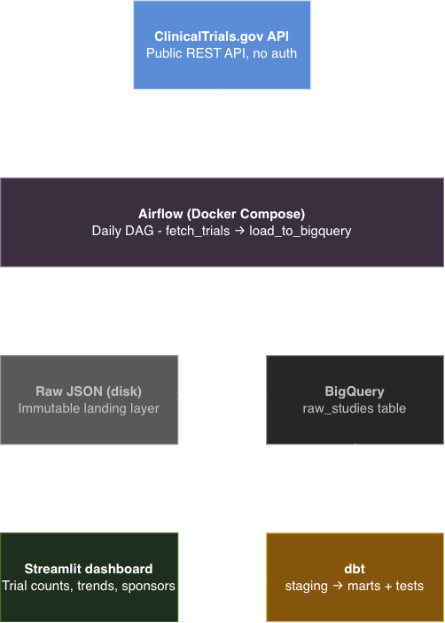

# Cancer Clinical Trials Data Pipeline

An end to end data engineering pipeline that ingests cancer clinical trial data from the ClinicalTrials.gov API, transforms it using dbt, and visualizes insights through a Streamlit dashboard.

## Architecture

## Tech Stack

| Tool | Purpose |
|---|---|
| Apache Airflow | Pipeline orchestration and scheduling |
| Docker Compose | Local Airflow infrastructure |
| ClinicalTrials.gov API | Data source |
| Google BigQuery | Cloud data warehouse |
| dbt | Data transformation and quality testing |
| Streamlit | Analytics dashboard |
| Python | Core programming language |

## Pipeline Overview

1. **Ingest** — Airflow DAG runs daily, fetching cancer trial records from the ClinicalTrials.gov REST API and landing raw JSON to disk
2. **Load** — Raw JSON is flattened and loaded into BigQuery using a truncate-and-reload pattern
3. **Transform** — dbt staging model cleans and types the raw data; mart model aggregates trials by status, sponsor count, and date range
4. **Test** — dbt data quality tests validate uniqueness and null constraints on critical fields
5. **Visualize** — Streamlit dashboard surfaces trial counts, sponsor activity, and enrollment trends

## dbt Models
models/

├── staging/

│   ├── sources.yml

│   ├── schema.yml

│   └── stg_clinical_trials.sql

└── marts/

└── trial_summary.sql

## Project Structure
cancer-trials-pipeline/

├── dags/

│   └── clinical_trials_fetch.py

├── clinical_trials_dbt/

│   ├── models/

│   │   ├── staging/

│   │   └── marts/

│   └── dbt_project.yml

├── dashboard.py

├── docker-compose.yaml

└── .gitignore

## Setup

### Prerequisites
- Docker Desktop
- Python 3.11
- Google Cloud account with BigQuery enabled

### Running the Pipeline

1. Clone the repo
2. Add your Google service account credentials to `config/google_credentials.json`
3. Start Airflow:
```bash
docker compose up
```
4. Trigger the DAG at `localhost:8080`
5. Activate the virtual environment and run dbt:
```bash
source dbt-env/bin/activate
cd clinical_trials_dbt
dbt run
dbt test
```
6. Launch the dashboard:
```bash
streamlit run dashboard.py
```

## Data Quality

dbt tests validate the following on every run:
- `nct_id` is unique and not null across all trial records
- `overall_status` is not null
- `brief_title` is not null

## Key Design Decisions

- **Truncate-and-reload pattern** — raw table is overwritten on each DAG run to prevent duplicate records
- **Layered dbt architecture** — staging models handle cleaning and typing; mart models handle aggregation
- **Raw JSON landing layer** — raw data is preserved to disk before loading, enabling reprocessing without re-hitting the API
- **Docker Compose for Airflow** — ensures consistent, reproducible local environment without native installation